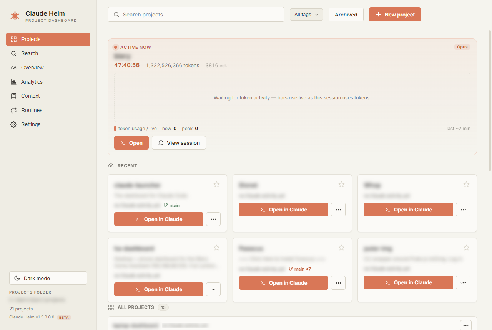
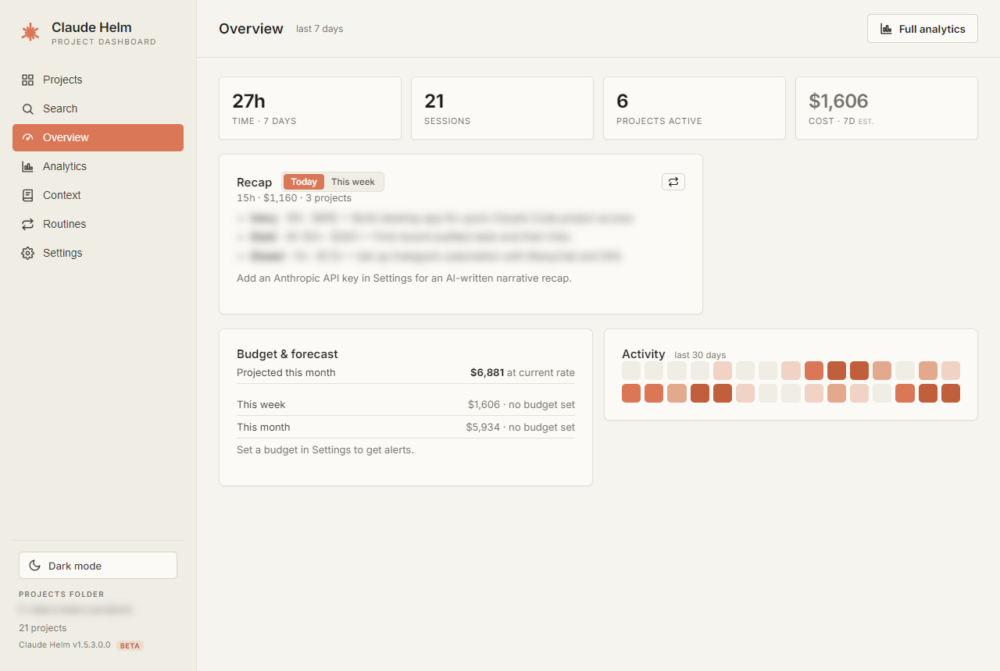
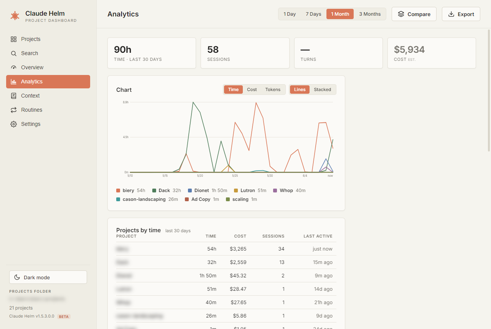
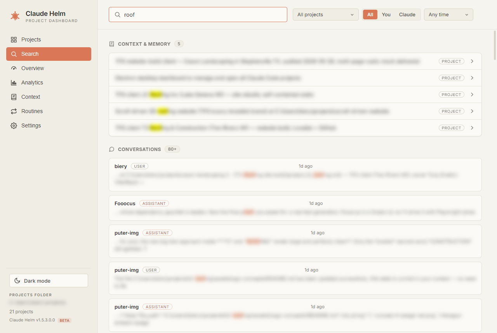
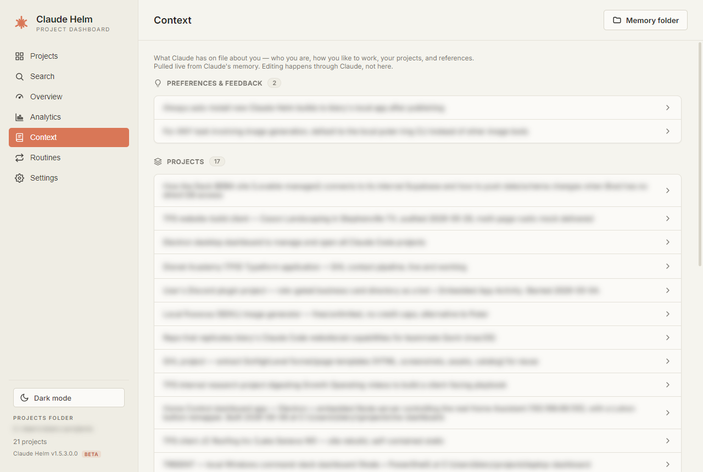
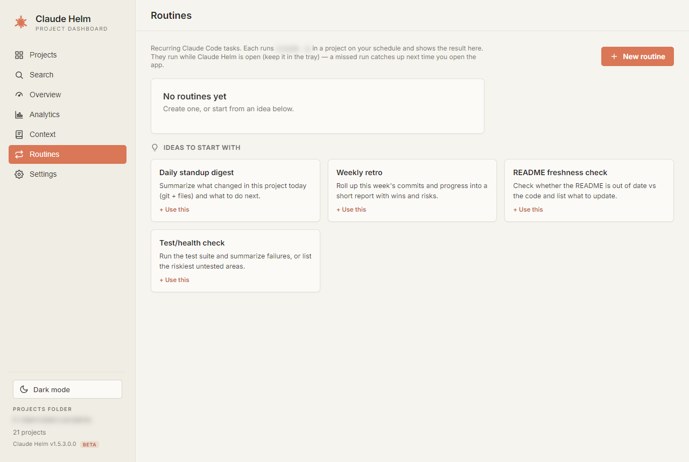
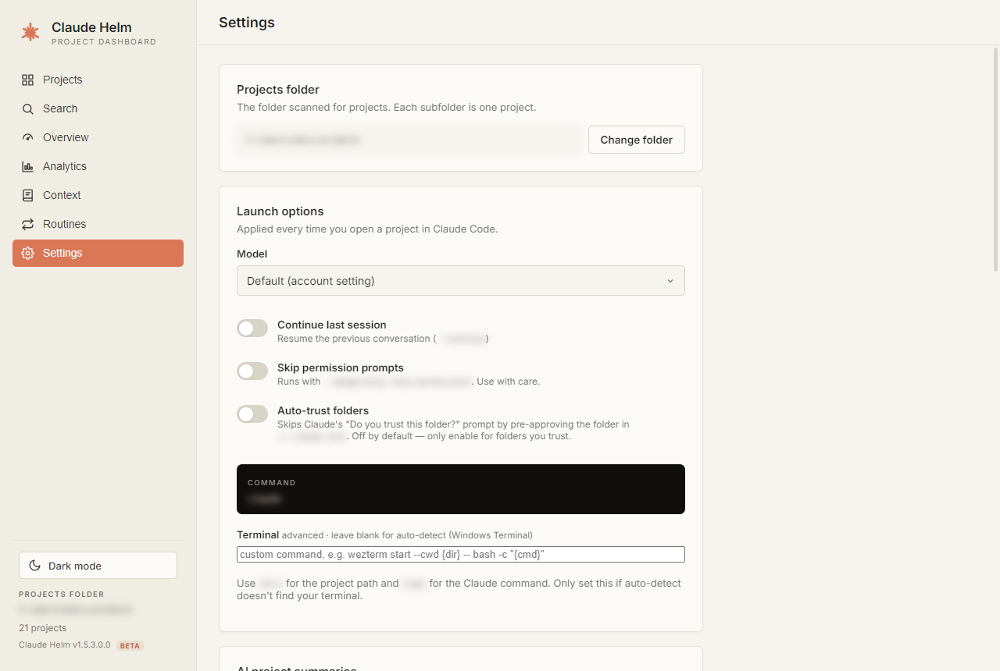
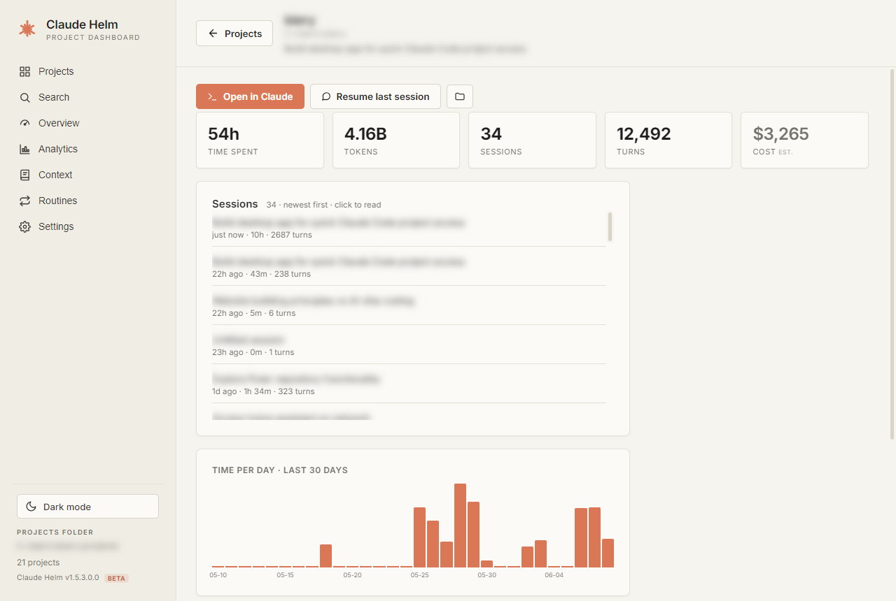

# Claude Helm — review brief

Hand this whole file to a reviewer. The repo is **public** — read it directly, no auth needed:
**https://github.com/trifactorscalingllc/claude-helm**

Screenshots of every screen are in [`docs/review/`](docs/review) (project names/paths are
intentionally blurred — they're private client names; critique layout, not content).

| | |
|---|---|
|  |  |
| **Projects (home)** | **Overview** |
|  |  |
| **Analytics** | **Search** |
|  |  |
| **Context** | **Routines** |
|  |  |
| **Settings** | **Project detail** |

---

## Paste this as the prompt

> You are a senior product designer + staff engineer doing a brutally honest design and product
> critique of a desktop app called **Claude Helm**. I want subtraction and prioritization, not a
> feature wishlist.
>
> **THE REPO** (public — read it directly, no auth): https://github.com/trifactorscalingllc/claude-helm
> Start with `renderer.js` (all UI), `index.html` (structure), `styles.css` (visual design),
> `main.js` (Electron main + IPC), `indexer.js` (the data engine). `README.md` has the feature list.
> Screenshots of every screen are in `docs/review/` (names blurred for privacy — critique layout).
>
> **WHAT IT IS** — a local Electron desktop app that turns your Claude Code history into a dashboard +
> launcher. It reads `~/.claude` (Claude Code transcripts + memory) and a projects folder on disk; an
> indexer tails every `~/.claude/projects/**/*.jsonl`, groups sessions by working directory, and
> computes time, cost (estimate), tokens, tools, files, models, bucketed per day/hour. 100% local, no
> account, no backend, no telemetry.
>
> **THE ONE JOB (as intended):** a solo dev who lives in Claude Code opens it to "see what's running,
> see what I touched recently, and jump back into a project in one click." Launcher + light monitor
> first; analytics second.
>
> **WHO IT'S FOR:** one technical user, their own machine. Not a team tool.
>
> **CURRENT SCREENS (7 nav tabs + sub-views):**
> - Projects (home/launcher): "Active now" live-session cards w/ a live token-usage bar graph; Pinned +
>   Recent projects as cards (name, summary, last-active·time·branch, Open button); the long tail as
>   compact rows; "Other Claude projects" (sessions run outside the folder).
> - Overview (glance dashboard, fixed last-7-days): KPI row, AI Recap (today/week), Budget, 30-day
>   heatmap, optional real-billing.
> - Analytics (deep, range selector): a configurable chart (Time/Cost/Tokens × Lines/Stacked),
>   projects-by-time table, spend-by-model, trends, longest-sessions, MCP usage, Compare, CSV export.
> - Search: across all conversations + memory; filters; opens an in-app transcript viewer.
> - Context: "what Claude remembers about you" (memory files + global CLAUDE.md), grouped.
> - Routines: recurring `claude -p` tasks on a schedule, per project, results inline.
> - Settings: projects folder, launch options, AI key, admin/billing key, budget, startup, about.
> - Sub-views: Project detail (launch actions, usage KPIs, sessions list, activity chart, collapsed
>   token/tool/file breakdown, notes); Transcript viewer (read + Branch/Resume a session).
> - Global: ⌘K command palette, system tray, auto-update toast.
>
> **HARD CONSTRAINTS (don't suggest fixing — known/handled):**
> - Code-signing is already planned (ignore the unsigned-install friction).
> - "Cost" is an ESTIMATE (tokens × public API prices). The user is on a Max subscription, so it is
>   NOT their real bill. Known honesty problem — critique the framing, don't propose more cost metrics.
> - 100% local, single user, no backend. Don't propose accounts, cloud, or collaboration.
> - It was built reactively feature-by-feature — assume it's over-built and incoherent until proven
>   otherwise. Bias hard toward cutting.
>
> **DESIGN PRINCIPLE TO ENFORCE:** every visual choice must trace to something real; generic "this
> looks nice" defaults are exactly what make software look AI-generated. Flag anything that reads as a
> templated AI dashboard (clay-accent rounded cards everywhere, KPI tiles, sparklines, segmented
> toggles with no point of view).
>
> **CRITIQUE RULES:**
> - Lead with the SINGLE biggest problem, then the next 4 in priority order. No flat list of 30 nitpicks.
> - For each: what's wrong → why it matters to the user → smallest change that fixes it → tag Cut/Change/Add.
> - Bias toward cutting and clarifying. If you suggest adding, justify why it earns its place.
> - Separate "this is broken/wrong" from "this is just my taste."
> - Don't suggest: code-signing, more analytics, more metrics, accounts/cloud, or features it already has.
>
> **ANSWER THESE LENSES SPECIFICALLY:**
> 1. Purpose: open the home screen cold — what one question does it answer in 3 seconds? Is that the
>    right question? Does anything compete with it?
> 2. Hierarchy: on each screen, what's the focal point? Is everything the same visual weight?
> 3. Every-metric test: for each number shown, what does the user DO differently because of it? List the deletes.
> 4. Cost framing: it leads with a dollar estimate the user doesn't pay. Is that honest? Fix it.
> 5. First run: a stranger with zero Claude history installs it — walk the first 60 seconds. Where do
>    they get lost or underwhelmed?
> 6. Identity: does this look like a real product with a point of view, or a generic AI dashboard?
>    What single move would give it a real identity?
> 7. Coherence: is this one product or three (launcher + monitor + analytics) stapled together?
>    Should it be narrower?
>
> **OUTPUT FORMAT:**
> (A) The one core problem, in 2 sentences.
> (B) Top 5 issues — each as: Problem → Why it matters → Smallest fix → [Cut/Change/Add].
> (C) A "delete list" of things to remove entirely.
> (D) One bold idea you'd try if this were your product.
